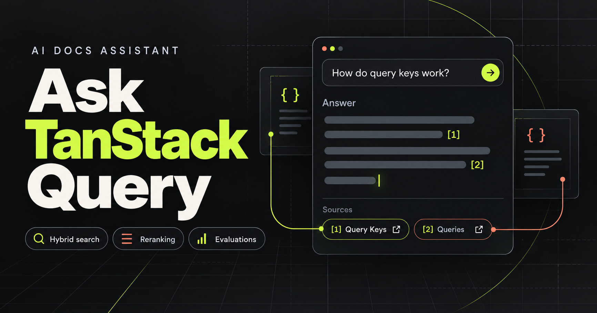

# Ask TanStack Query

One question. Official docs. Search first, then one model call.

## Demo

The two-minute demo and the write-up will be linked here once the assistant is live. The opening beat is a model that still says `cacheTime`. The same question, answered from the current docs, comes back with the page it used.

## The customer problem

A developer asks an AI about TanStack Query and pastes the code it returns. The model learned an older version, so it still mentions `cacheTime` and `onSuccess` on `useQuery`. TanStack Query v5 renamed or removed those. The answer sounds confident, and nothing records whether it was right.

Ask TanStack Query is an unofficial portfolio prototype of the librarian step:

Ingest → Retrieve → Rerank → Answer → Grade

The program answers from the official React docs and cites the page. It does not edit the docs, post in GitHub Discussions, or speak for the TanStack team.

## What it does

- Reads the TanStack Query React docs, which ship as Markdown files
- Splits each page into chunks and stores them in Postgres with embeddings
- Finds passages by keyword and by meaning, then a reranker keeps the best five
- Streams an answer that cites the docs pages it used
- Says when those pages do not contain the answer
- Scores each change on a quiz of real GitHub questions and keeps a scoreboard

## Stack

| Layer | Choice | Why |
| --- | --- | --- |
| Language | Python 3.12 | Loads the docs, retrieves passages, and calls the model |
| API | FastAPI | Streams the answer to the browser |
| Model | OpenAI | Writes the cited answer, and turns text into embeddings |
| Database | Supabase Postgres + pgvector | Stores chunks and finds nearby meanings |
| Reranker | Cohere | Narrows a shortlist to the five passages the model may use |
| Front end | Next.js | The page where someone asks a question |
| Evals | Quiz from GitHub Discussions | Grades each change against real questions with known answers |
